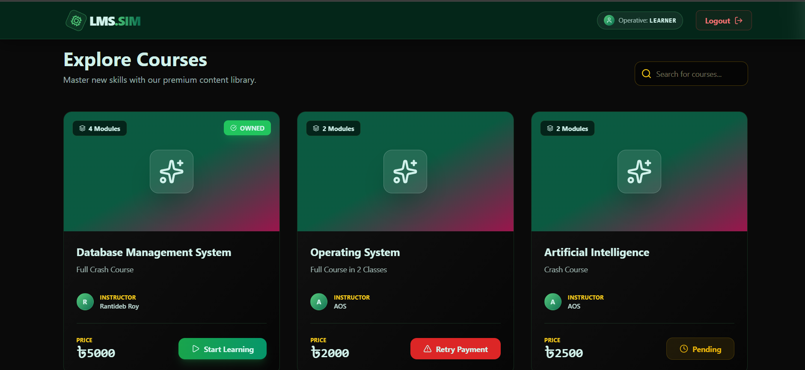
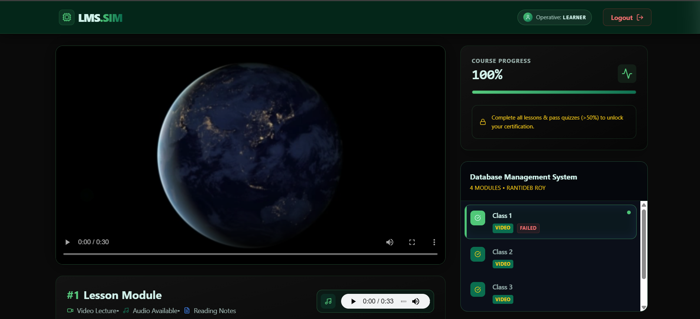
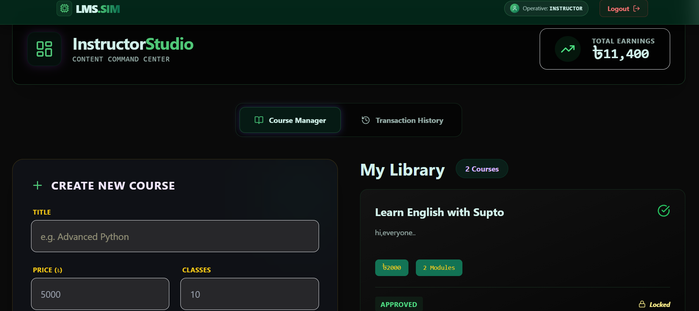
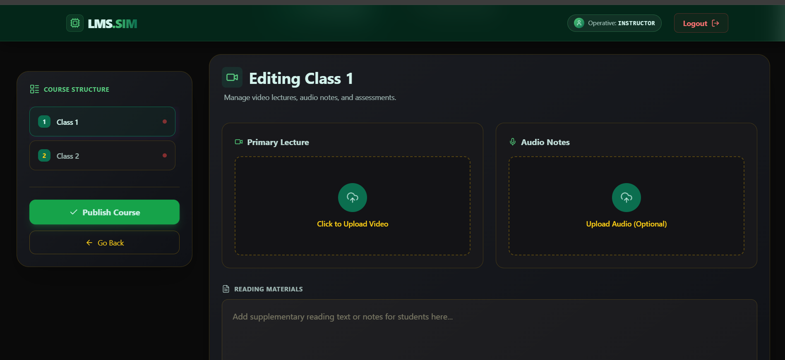
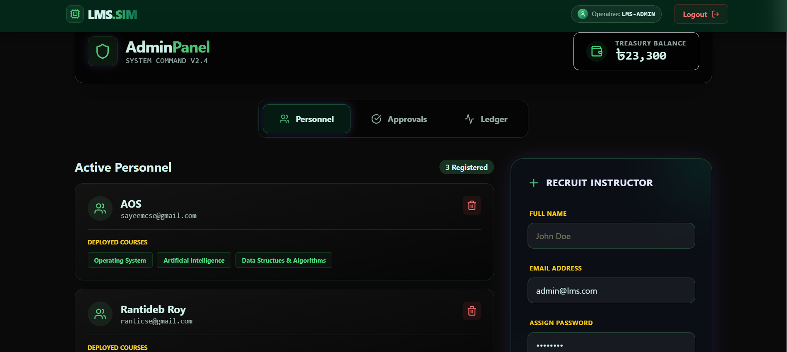

# LMS Simulation (Learning Management System)

A comprehensive Learning Management System built using the MERN stack (MongoDB, Express, React, Node.js). This platform allows various user roles (Learner, Instructor, Admin) to interact in a simulated e-learning environment.

## 🚀 Features

### For Learners
- **Course Exploration:** Browse available courses with thumbnails and details.
- **Enrollment:** Enroll in courses using simulated transaction processing via a mocked bank API.
- **Progress Tracking:** Keep track of your progress as you complete course modules.
- **Assessments:** Take Multiple Choice Question (MCQ) quizzes with automatic checking.
- **Certification:** Automatically generate and download certificates as PDFs upon course completion.

### For Instructors
- **Dashboard:** An intuitive instructor dashboard to manage courses.
- **Course Management:** Create, view, and organize courses.
- **Media Upload:** Upload course thumbnails securely using Cloudinary.

### For Administrators
- **User Management:** Oversee and manage instructors and learners.
- **Course Moderation:** Monitor the course catalog.

## 💻 Tech Stack

**Frontend Framework:** React.js, Vite
**Styling & UI:** Tailwind CSS, Framer Motion (for animations), Recharts (for data visualization), Lucide React (for icons)
**Backend & API:** Node.js, Express.js
**Database:** MongoDB & Mongoose
**Authentication:** JSON Web Tokens (JWT) & bcrypt/bcryptjs
**Media Management:** Cloudinary
**Document Generation:** PDFKit (for certificate generation)

## 📁 Project Structure

```
lms-simulation/
├── client/           # React frontend application
│   ├── src/          # Source files containing components, pages, context, etc.
│   ├── package.json  # Frontend dependencies and scripts
│   └── vite.config.js# Vite bundler configuration
│
└── server/           # Node.js + Express backend
    ├── models/       # Mongoose database schemas
    ├── routes/       # Express route handlers (admin, auth, bank, instructor, learner)
    ├── server.js     # Backend entry point
    └── package.json  # Backend dependencies
```

## 📸 Screenshots

<details>
<summary><b>Click to expand and view screenshots</b></summary>

### 🎓 Learner Experience
| Explore Courses | Course Player & Progress |
| :---: | :---: |
|  |  |

### 👨‍🏫 Instructor Experience
| Instructor Dashboard | Create Course |
| :---: | :---: |
|  |  |

### 🛡️ Administrator View
| Admin Dashboard |
| :---: |
|  |

</details>

## ⚙️ Installation & Setup

### Prerequisites

- [Node.js](https://nodejs.org/) (v16+ recommended)
- [MongoDB](https://www.mongodb.com/) (Local instance or MongoDB Atlas cluster)
- [Cloudinary Account](https://cloudinary.com/) (For image uploads)

### 1. Clone the Repository

```bash
git clone <your-github-repo-url>
cd lms-simulation
```

### 2. Setup the Backend

```bash
# Change directory
cd server

# Install dependencies
npm install

# Create a .env file and configure the necessary variables
# Example:
# PORT=5000
# MONGO_URI=your_mongodb_connection_string
# JWT_SECRET=your_jwt_secret
# CLOUDINARY_CLOUD_NAME=your_cloudinary_name
# CLOUDINARY_API_KEY=your_cloudinary_api_key
# CLOUDINARY_API_SECRET=your_cloudinary_api_secret

# Start the server (development)
npx nodemon server.js
# Or
node server.js
```

### 3. Setup the Frontend

Open a new terminal window/tab:

```bash
# Change directory
cd client

# Install dependencies
npm install

# Start the application
npm run dev
```

The frontend will typically run on `http://localhost:5173` and the backend will run on the port specified in your `.env` file (e.g., `http://localhost:5000`).

## 🔑 Key Features Overview

- **Simulated Payment Gateway (`bank.js`):** Handles mocked transactions to process course purchases within the simulation.
- **Dynamic Certificate Generation:** Learner certificates are generated dynamically via `PDFKit` upon satisfying course requirements.
- **Real-time Course Metrics:** The dashboard employs `Recharts` to provide instructors with insights regarding learner progress.

## 🤝 Contributing
Contributions, issues, and feature requests are welcome!

## 📜 License
This project is licensed under the ISC License.
